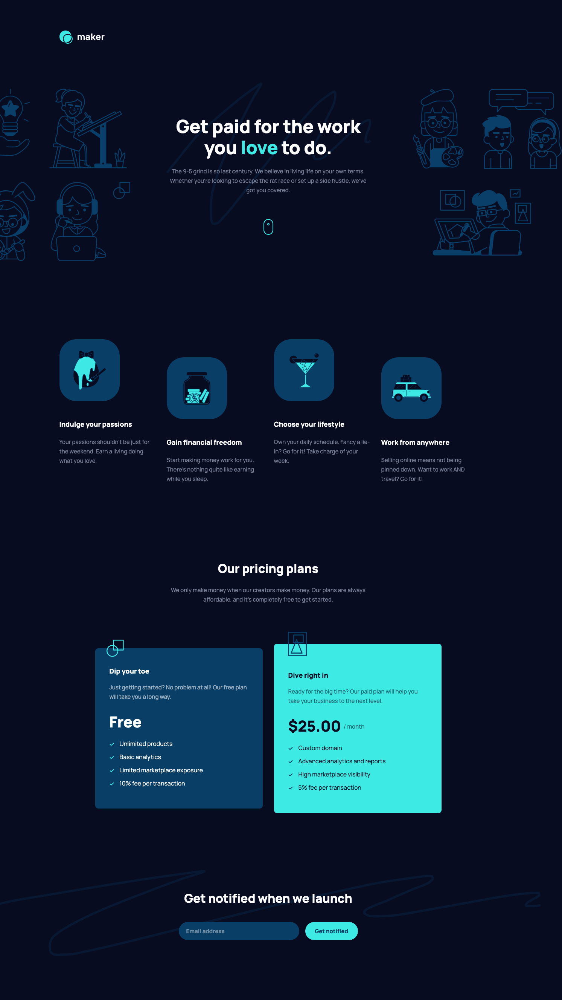

# Maker pre-launch landing page solution

This is a solution to the [Maker pre-launch landing page challenge on Frontend Mentor](https://www.frontendmentor.io/challenges/maker-prelaunch-landing-page-WVZIJtKLd). Frontend Mentor challenges help you improve your coding skills by building realistic projects.

## About the Project

This project is designed to showcase a product before its official launch. Built with **React** using `create-react-app`, this landing page focuses on creating a sleek, pre-launch experience for users.

## Preview and Links

<b>Open Preview</b>

 

 

| View it live: | [Live Demo URL](https://ionstici.github.io/maker-pre-launch-landing-page) | [Frontend Mentor](https://www.frontendmentor.io/solutions/maker-prelaunch-landing-page-gpR9ScGgva) |
| ------------- | ------------------------------------------------------------------------- | -------------------------------------------------------------------------------------------------- |

## Features

- **Pre-Launch Aesthetic:** A visually appealing design to generate excitement for the upcoming product.
- **Responsive Design:** Built to adapt seamlessly across various devices, ensuring a consistent user experience.

## Tech Stack

- **React:** Leveraged with `create-react-app` for efficient React development.
- **Scss:** For advanced styling, providing a structured approach to CSS with variables and nested selectors.

## Deployment

This project uses **GitHub Pages** for hosting.
